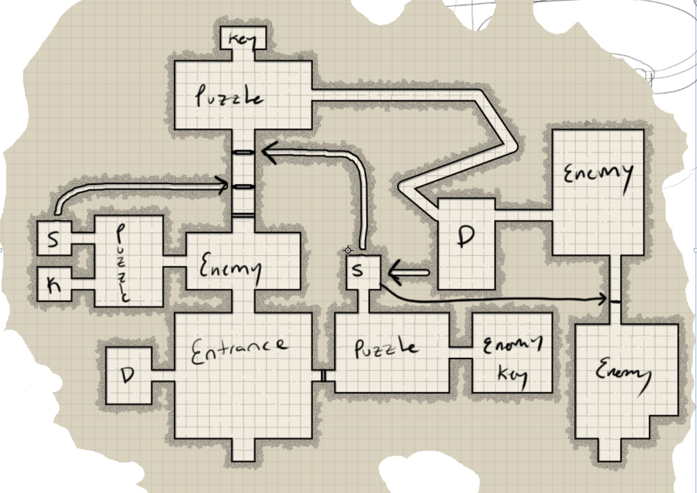
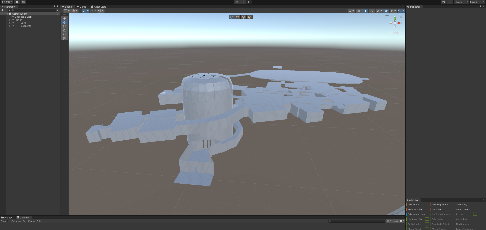

# Zov
  This is my passion game! It is a Fantasy/Singleplayer inspired by Skyrim and Avowed. It will contain Magic, Combat, Archery, Crafting, Co-op, and other things that will come to mind.

# How it came to be
  I had a dream of how one of my levels played out and now it inspired me to try and develop my own Skyrim-like game.
  It seems to me like Avowed and Skyrim are the only types of games where they provide an immersive first-person RPG game.
# Story
  This is still in concept, I am working with friends and deciding more on how it sounds.

# Magic
  For Magic, I know I want the player to cast, enchant, set traps, and enhance partners. I don't know what kind of magic system I want. Most likely it is going to be a soft magic system rather than a hard magic system. I know that hard magic systems, if done well, can greatly improve immersability within the player but it will be hard to balance and create within its own story. I can start as a soft magic system for now and see how I want it to change later on.

  The player will have mana and have spells that affect is regeneration and cost of other spells.

# Combat
  For Combat, I want a better system than what Skyrim has. Skyrim's combat is simple but provides no impact, It feels like it remove immersion when you swing and they take it like nothing. I also want the system to have its own uniqueness, like For Honor or Elden Ring, where it makes every enemy different than the rest.

  I am thinking of a system combining Chivalry II and For Honor for now but I am still in the concept phase and will see how I want it to be.

# Dream Level Idea 
  I created the dream level in its white box form to get my idea in its "physical" form.
  I created a quick idea from a website called [Dungeon Scrawl](https://probabletrain.itch.io/dungeon-scrawl)
  

## White Box
  Then I created a quick white box from my dream and using the dungeon scrawl to help with proportions.
  

# Conclusion
This is what I have so far. I wish I can spend more time on this but I am currently taking 6 classes at PVAMU and an additional 2 gaming courses at Lone Star College. I will try publish my dream game one day and I hope you can follow its journey to become a full fledged game.
